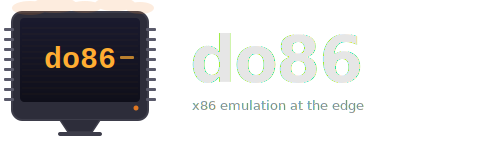

<p align="center">
  
</p>

<p align="center">
  <strong>x86 operating systems running inside Cloudflare Durable Objects</strong>
</p>

<p align="center">
  <a href="https://workers.cloudflare.com"></a>
  <a href="https://github.com/copy/v86"></a>
  
  
</p>

---

A full x86 PC emulated at the edge using [v86](https://github.com/copy/v86). The browser connects over WebSocket and receives compressed framebuffer updates — no plugins, no VNC client, just a `<canvas>`.

## How It Works

```
┌────────────┐              ┌────────────┐              ┌─────────────────────┐
│            │  WebSocket   │            │     RPC      │                     │
│  Browser   │◄────────────►│   Worker   │◄────────────►│   Durable Object    │
│            │              │            │              │                     │
│  canvas    │ frames+input │  routes    │   assets     │   v86 emulator      │
│  keyboard  │              │  packs     │              │   screen adapter    │
│  mouse     │              │  assets    │              │   delta encoder     │
│            │              │            │              │   SQLite (10 GB)    │
└────────────┘              └────────────┘              └─────────────────────┘
```

1. **Browser** opens a WebSocket to the Worker, requesting an OS image
2. **Worker** loads BIOS + disk image from Assets, packs them into a binary bundle, and forwards to the Durable Object
3. **Durable Object** boots v86 with the assets — a full x86 CPU emulated in WebAssembly
4. **Frames** are captured from the virtual VGA, delta-compressed (tile-based diffing + RLE), and streamed back over the WebSocket
5. **Input** (keyboard scancodes, relative mouse deltas) flows back from browser to the emulator's bus

## Quick Start

```sh
bun install
bun run dev
# → http://localhost:5173
```

## Images

| Image | OS | Notes |
|-------|----|-------|
| **`kolibri`** | KolibriOS | Default. Full GUI, boots in seconds |
| `dsl` | Damn Small Linux | Fluxbox + Firefox, 128MB RAM |
| `helenos` | HelenOS | Research microkernel OS |
| `linux4` | Linux 4.x | Minimal text-mode kernel |

Browse to `/` to see the landing page with all available images. Click **Launch** to create a unique session at `/s/{id}?image=kolibri`. Share the session URL with others to let them view the same VM in real time.

## Technical Notes

- **JIT** — v86 compiles x86 basic blocks to Wasm functions at runtime (~10-100x faster than interpretation)
- **SQLite swap** — DO SQLite storage backs a 10GB lazily-allocated virtual swap disk
- **Delta compression** — only changed 64×64 pixel tiles are sent; RLE-encoded for solid-color regions (title bars, backgrounds)
- **Adaptive FPS** — 2–15 FPS, auto-adjusts based on frame size and client backpressure
- **State snapshots** — v86 machine state saved to SQLite after first boot; subsequent sessions restore instantly (~840ms vs ~11s cold boot)
- **Multi-client** — multiple browsers can connect to the same VM instance simultaneously

## Project Structure

```
src/
├── index.ts              Worker — routing, image config, asset packing
├── linux-vm.ts           Durable Object — v86 lifecycle, WebSocket, render loop
├── types.ts              Shared constants and interfaces
├── screen-adapter.ts     VGA screen adapter + ImageData polyfill
├── delta-encoder.ts      Tile-based frame diffing + RLE compression
├── sqlite-storage.ts     SQLite image cache, block device, disk cache
├── client/
│   ├── main.ts           Browser client — WebSocket, canvas, input capture
│   ├── decoder.ts        RLE decode, frame parsing
│   └── session.css       Session page styles
└── v86.wasm              Pre-compiled v86 emulator module
```

## License

MIT
